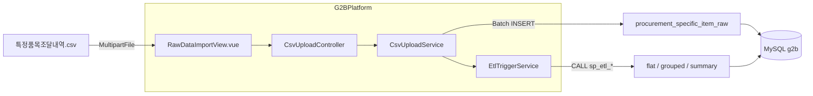

# CSV 적재·ETL G2BPlatform 이전 계획

> **상태:** 계획만 수립 (구현 미착수)  
> **작성 배경:** 조달데이터허브 보고서 통합(2026-03-18) 이후, 통합 **특정품목 조달 내역** CSV를 재수신함. 기존 `procurement-bot`(Python) 수동 적재 대신 G2BPlatform 웹에서 업로드·ETL까지 처리하도록 이전 예정.

---

## 1. 배경

### 조달데이터허브 보고서 통합

| 기존 보고서 | 통합 후 |
|------------|---------|
| 물품 계약 상세내역 + 특정품목 조달 내역 | **특정품목 조달 내역** 하나 |
| 공사 계약 내역 + 용역 계약 업체 내역 | **업무별 구성원별 계약내역** |

- 기존 두 물품 CSV는 **양식·행 단위(키)가 달랐음** → 단순 병합 불가.
- 신규 데이터는 **통합 특정품목 조달 내역** 기준으로 받아 적재·ETL 재구성.

### 현재 레포 역할

| 레포 | 역할 |
|------|------|
| **procurement-bot** | Python: CSV 다운로드(Selenium) + raw 적재 + MySQL 저장 프로시저 ETL |
| **G2BPlatform** (본 레포) | Spring Boot + Vue 3: `g2b` DB 조회·보고·대시보드 |

- DB: 둘 다 MySQL **`g2b`** 공유 (설정 파일은 각 레포 독립).
- **procurement-bot은 삭제하지 않고 아카이브** 유지. 신규 개발은 G2BPlatform만.

### 프로젝트 합치기 여부

**모노레포(Python + Java 한 레포)는 권장하지 않음.** 배포·빌드가 복잡해짐.

- CSV **웹 업로드 + ETL 트리거** → **Java(Spring Boot)** 로 구현.
- 참고 구현: `procurement-bot/specific_item_upload.py`, `create_procedure_etl_*.sql`.

---

## 2. 목표 아키텍처

### 데이터 흐름 (Python과 동일 규칙을 Java로)

| 단계 | 내용 |
|------|------|
| 업로드 | UTF-16, 탭 구분 TSV |
| 헤더 | `"조달방식구분"` 포함 줄 = 헤더 시작 (`specific_item_upload.py`와 동일) |
| 컬럼 매핑 | 한글 헤더 → 영문 컬럼 (`KOR_TO_ENG` → Java `Map`) |
| 적재 | JDBC Batch Insert, 10,000행 단위 → `procurement_specific_item_raw` |
| ETL | `CALL sp_etl_shopping_mall()`, `CALL sp_etl_procurement_contracts()` (기존 프로시저 유지) |

### ETL 분기 (raw 1테이블 → 조회용 테이블)

| 용도 | 필터 | 적재 테이블 |
|------|------|-------------|
| 물품 계약 조회 | `contract_type <> '제3자단가계약'` + 탑 두 회사 품목 쌍 | `procurement_contract_flat`, `procurement_contract_grouped` |
| 쇼핑몰(3자단가) | `contract_type = '제3자단가계약'` | `shopping_mall_flat`, `shopping_mall_summary` |

물품 ETL 타깃 품목: 탑인더스트리(`1188117437`), 탑정보통신(`1188119624`)의 `is_final_contract='Y'` 계약에서 추출한 **(물품분류번호, 세부품명번호) 쌍** (현재 DB 기준 분류번호 **27개**, 쌍 **29개**).

### 허브 다운로드 조건 (특정품목 조달 내역)

- **물품분류번호 27개 필수** (예전 물품 계약 상세는 분류 미지정이었음).
- 세부품명·업체·수요기관 등은 미입력, 하위기관 미포함, 기준일자만 연도/분기 구간 설정.
- 다운로드 시 최종/최초 계약여부는 **비워도 됨**; ETL에서 물품은 **`is_final_contract = 'Y'`** 만 사용 (쇼핑몰 ETL은 계약유형만 필터).

**27개 물품분류번호:**  
`21101593`, `39121006`, `39121011`, `39121101`, `39121103`, `39121104`, `39121106`, `39121189`, `39121198`, `39121801`, `39122245`, `40101806`, `41111938`, `41112407`, `41112498`, `41112501`, `41113319`, `41115613`, `43201402`, `43201802`, `43232304`, `45111811`, `46171622`, `60131303`, `72151699`, `73152180`, `81111599`

---

## 3. 신규·수정 예정 파일

### 백엔드 (`backend/src/main/java/org/example/g2bplatform/`)

| 파일 | 역할 |
|------|------|
| `controller/CsvUploadController.java` | `POST /api/admin/upload/specific-item` (MultipartFile, ADMIN) |
| `service/CsvUploadService.java` | UTF-16 TSV 파싱, Batch Insert → `procurement_specific_item_raw` |
| `service/EtlTriggerService.java` | `sp_etl_shopping_mall`, `sp_etl_procurement_contracts` 등 CALL |
| `dto/CsvUploadResultDto.java` | 적재 행 수, 소요 시간, 오류 메시지 |

**참고 소스 (procurement-bot):**

- `specific_item_upload.py` — `detect_header_row`, `KOR_TO_ENG`, 청크 적재
- `create_procedure_etl_shopping_mall.sql`
- `create_procedure_etl_procurement_contracts.sql`

### 프론트엔드

| 파일 | 역할 |
|------|------|
| `frontend/src/views/RawDataImportView.vue` | 이미 골격 존재 — 업로드 API 연동, 진행·결과 UI |

### SQL 참고용 보관 (구현 시)

- `procurement-bot/*.sql` → `backend/src/main/resources/sql/etl/` 복사 (Flyway 아님, 운영·재생성 참고용)

---

## 4. 구현 순서 (추후 작업)

1. `CsvUploadService` — 파싱 + `procurement_specific_item_raw` Batch Insert
2. `EtlTriggerService` — 저장 프로시저 호출
3. `CsvUploadController` — 업로드 API + ADMIN 권한
4. `RawDataImportView.vue` — API 연동 및 결과 표시
5. ETL 프로시저 동작 검증 (flat/grouped/summary, `dataSource=all` 대시보드)

---

## 5. 범위 밖 (별도 계획)

| 항목 | 비고 |
|------|------|
| 공사·기술용역 | **업무별 구성원별 계약내역** Excel — 별도 업로드·스키마 설계 필요 |
| Selenium 자동 다운로드 | procurement-bot `main.py` 유지 또는 추후 별도 결정 |
| `procurement_raw` (구 물품 계약 상세) | 통합 CSV로 대체 후 신규 적재는 specific_item raw + ETL 경로 |

---

## 6. 체크리스트 (구현 시)

- [ ] UTF-16 LE/BE 인코딩 처리
- [ ] 대용량 파일 메모리 (스트리밍 파싱)
- [ ] 업로드 중 타임아웃·트랜잭션 (raw 적재 vs ETL 분리 여부)
- [ ] 적재 로그 테이블 (`procurement_specific_item_ingestion_log` 등) Java에서 기록 여부
- [ ] `sp_refresh_shopping_mall_summary()` 호출 순서
- [ ] 기존 보고서 API (`ReportProcurementService`, `ShoppingMallService`) 회귀 테스트

---

## 7. 관련 문서·화면

- procurement-bot: `README.md` (보고서 통합 안내), `docs/completed_folders_조달데이터허브_다운로드_조건.md`
- G2BPlatform: `docs/plan_report_goods_table_id.md`, `frontend/src/views/RawDataImportView.vue`
- 조회 API: `ReportDataController`, `ShoppingMallController`, `ReportProcurementService`
